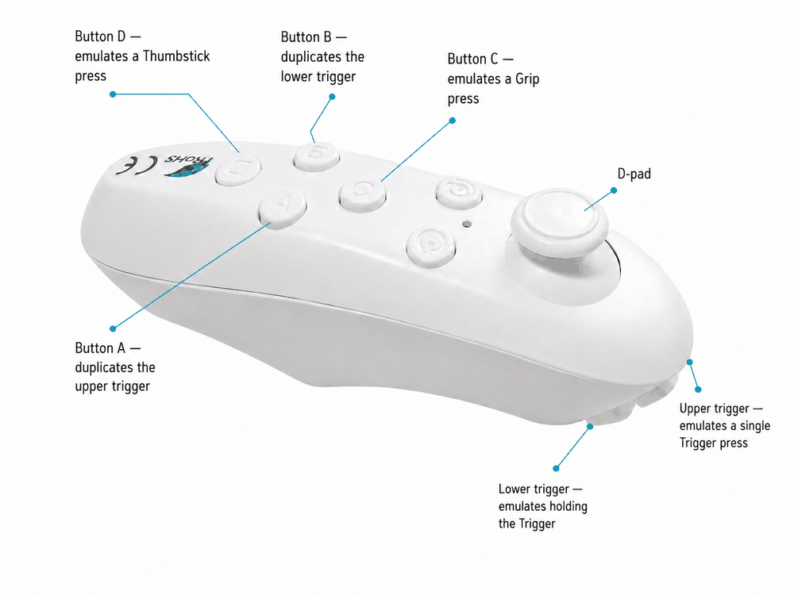

## Emulating a VR controller via external input

Without this, input will be limited to gestures (pinch, grab).

Bluetooth controllers, USB keyboards, and joysticks can be mapped to runtime controller input.

Also you can use 2 identical Bluetooth controllers.

You don't need to have special joysticks; you can use some of the keyboard keys to customize buttons that are rarely used (for example, system or menu).
But overall, I recommend using both joysticks if you want to fully utilize hand-tracking with controls + you can use a keyboard with rare keys.

I tested on two identical "vr-park bluetooth 3.0" joystick

Example layout on vr-park:
<p align="center">
  
</p>


To set up controller emulation, follow these steps:
```bash
cd ~/xr-gate-release/xreal_ultra

devices/xreal_ultra/linux/scripts/override_controller/start_override_controller.sh
```
and follow the instructions on the command line

The config will be saved in ~/.config/xr_tracking/override_controller/default.json If you want to retrain, you can delete default.json for new train

After this, you can enable controller emulation in xr_client. To do this, enable override_controller (by pressing "5").
Once enabled, gestures are automatically disabled to avoid input conflicts.

1. If you use an external controller, you can continue to use controller input when you lose hand tracking (default behavior)

2. Also, when you hold the joysticks in your hands, your hands will physically be rotated at an angle. You can use the rotation angle offset via the config in xr_runtime to rotate your hands in VR.


An example of rotating the hands 60 degrees:
```bash
      "hand_orientation_offset": {
        "enabled": true,
        "multiply_order": "post",
        "apply_to": {
          "controller": true,
          "palm": true,
          "wrist": true,
          "joints": false
        },
        "left": {
          "enabled": true,
          "rx_deg": 0.0,
          "ry_deg": 0.0,
          "rz_deg": -60.0
        },
        "right": {
          "enabled": true,
          "rx_deg": 0.0,
          "ry_deg": 0.0,
          "rz_deg": 60.0
        }
      }
```

An example config for VR-Park: xr_21_joint_hand_viewer_verified_controllers.json
